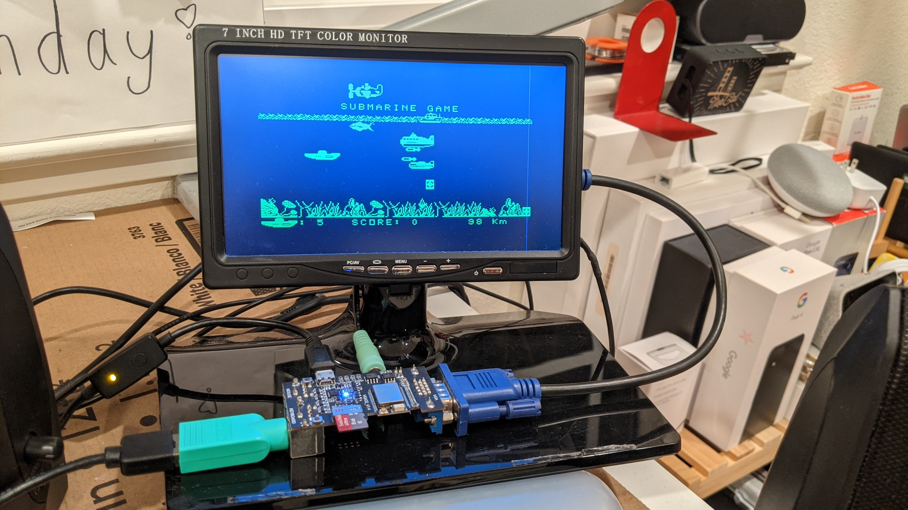
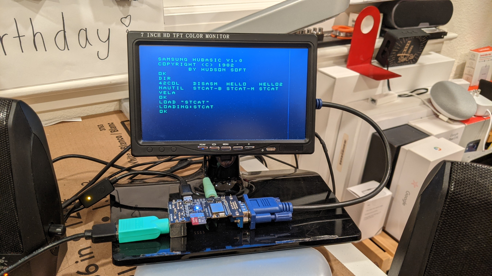

# TTGO VGA32 Bare-metal SPC-1000 emulator

## What is this?
This repo provides the emulator for [SPC-1000](https://en.wikipedia.org/wiki/SPC-1000), 8-bit PC produced by Samsung back in 80s, running on [TTGO VGA32](https://www.lilygo.cc/products/fabgl-vga32?srsltid=AfmBOop8-ClCY9N2DyQ304dntEUzOV5FXcsA8I_89iQg2uh22UNng-HH).



## How to Build
Use the following versions of build tools/configurations: 
 - Arduino 1.8.18 
 - fabgl 1.0.9
 - board: TTGO T7 V.14 Mini32 

`mem.c` that contains the ROM image is generated as follows: 

```
esp32-spc1000$ z80asm -o dos src/dos.asm
esp32-spc1000$ python gen_romc.py dos > src/mem.c 
```
Follow this [instrucables article](https://www.instructables.com/A-VGA-Computer-Based-on-ESP32-and-FabGL-With-Sound/) for setting up the build environments. 

## Mods

Some enhancements were made to IOCS/Basic interpreter to run the emulator smoothly on the platform:
 - Added new disk-like operations for file access to cassette I/O: 
   * DIR
   * DEL
   * LOAD/SAVE <FILE> work as before. LOAD without filename opens a file picker dialog on screen.
   


 - Accelerated I/O: IOCS routines for LOAD/SAVE was rewritten (PWM replaced with direct bit control) to speed up the access.

 - Dynamic configuration is possible via I/O ports. These settings persist across power cycle (TODO):
```
OUT &H800A,<0/1>: Toggles font face between MC6847/CGBUF (MC6847 by default)   
OUT &h800B, <0/1>: Turns on/off vintage CRT effect (on by default)
```
## Credits
 - [Ionique blog](https://blog.naver.com/ionique/10014343202), the first SPC-1000 emulator on which this S/W is based
 - [Z80 portable emulator package](https://fms.komkon.org/EMUL8/) of Marat Fayzullin

